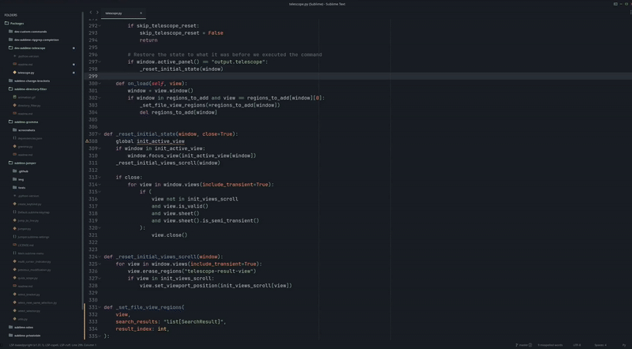

# Sublime - Telescope
Sublime text plugin that mimic the "live grep" feature of the [telescope](https://github.com/nvim-telescope/telescope.nvim) plugin from VIM.

That plugin work with [ripgrep](https://github.com/BurntSushi/ripgrep) and [fzf](https://github.com/junegunn/fzf)

It will **fuzzy find** in all files following a glob expression, with an heuristic
- it will first use ripgrep with the 3 first characters and the 3 last ones
- it will apply fuzzy search on the result with fzf
- it will keep the 50 first results

<p align="center">
  
</p>

Ripgrep and fzf are configured in **"smart case"** mode (case insensitive if everything is lower case, case sensitive otherwise).

To reduce the search space, you first need to write a glob filter to apply on the files, like the sublime text search, you can specify many globs separated by a comma:
- `<empty>`: use the default ripgrep filters (follow `gitignore`, skip hidden files and binary, etc)
- `models/*.py`
- `.py`
- `.py, .js`
- `/views/*/src/*.html`

Debian / Ubuntu
> sudo apt install ripgrep fzf

MacOS
> brew install ripgrep fzf

Windows with choco
>  Set-ExecutionPolicy Bypass -Scope Process -Force; [System.Net.ServicePointManager]::SecurityProtocol = [System.Net.ServicePointManager]::SecurityProtocol -bor 3072; iex ((New-Object System.Net.WebClient).DownloadString('https://community.chocolatey.org/install.ps1'))

> choco install ripgrep fzf

# Keybind
```json
{
    "keys": ["ctrl+i"],
    "command": "telescope"
}
```

# TODO
- Use quick panel once that issue is done: https://github.com/sublimehq/sublime_text/issues/4796
- Change "selected by default" when https://github.com/sublimehq/sublime_text/issues/5507 is merged
- get the x first result with rg instead of head
